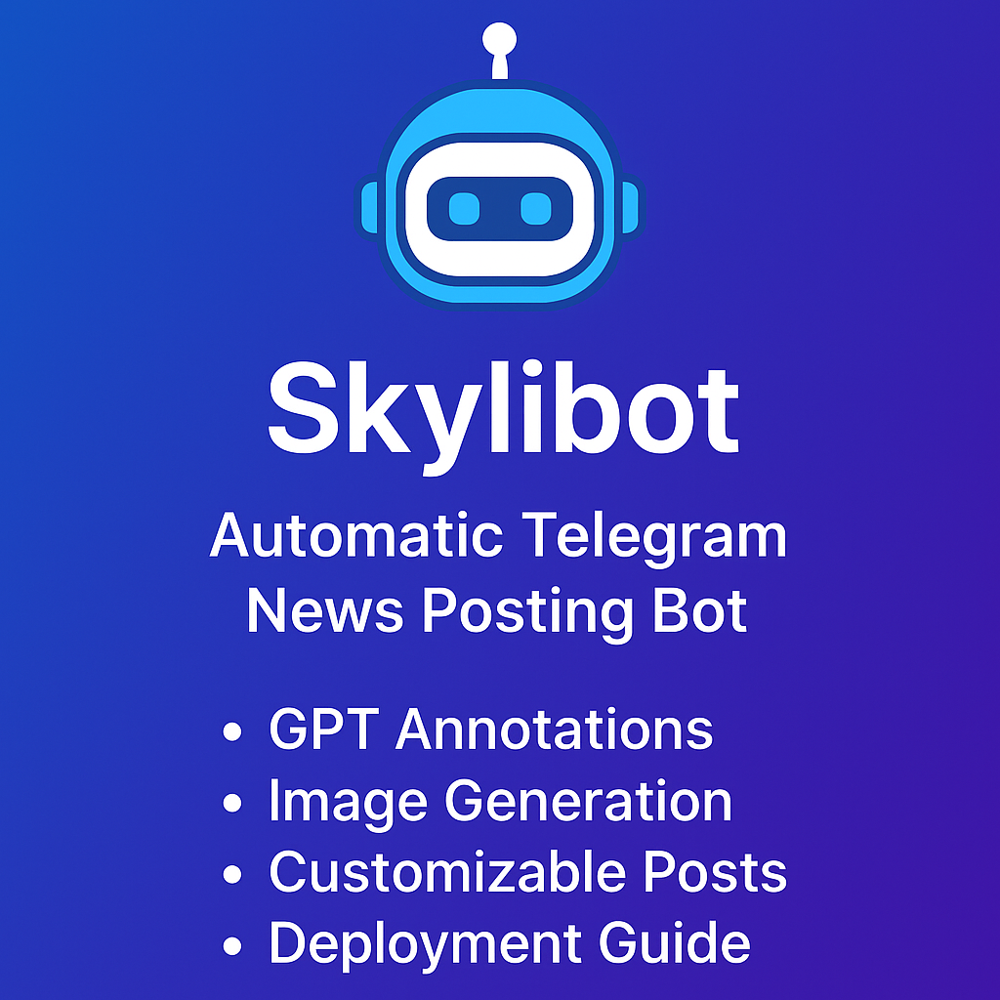

# Skylibot – Smart Telegram News Bot

Skylibot is an intelligent Telegram bot that publishes news every 30 minutes with annotation, image, and buttons.

## Features
- Automatic posting every 30 minutes
- GPT or fallback funny annotations
- Image generation via og:image or fallback
- Multi-channel support
- Styled posts: emojis, buttons, formatting
- /update command and logging

## Setup
1. Fill in `.env` like this:

BOT_TOKEN=your_bot_token  
CHANNEL_NICK=@skylibot  
CHAT_IDS=@yourchannel1,@yourchannel2  

2. Install dependencies:  
`pip install -r requirements.txt`

3. Run the bot:  
`python main.py`
